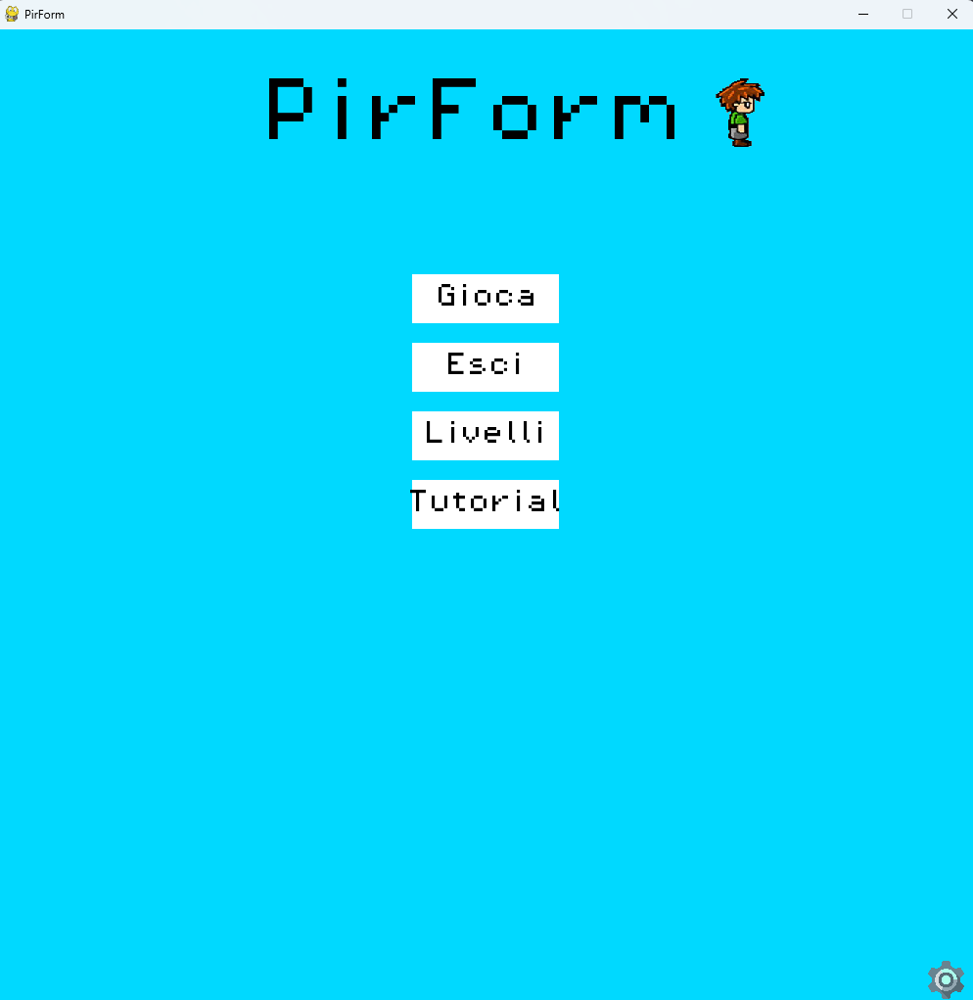
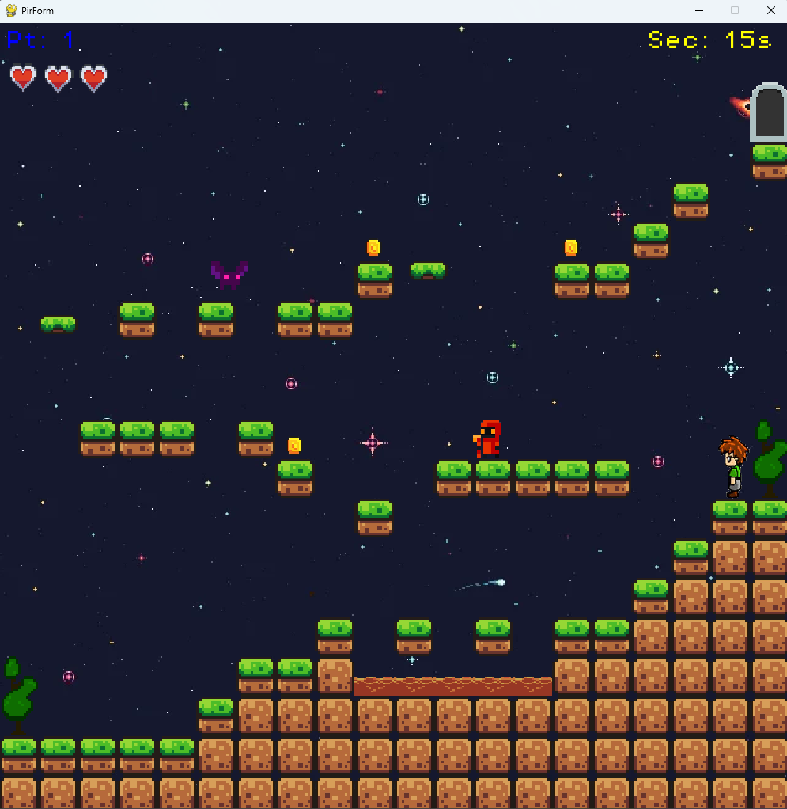

# 🎮 PirForm

**PirForm** is a small 2D platformer made with **Python** and **Pygame**.

Explore 3 different levels, collect coins, avoid enemies and lava, use moving platforms, and reach the door to complete the game.

## 🎯 Features

* 🗺️ 3 playable levels
* 🪙 Coin collection and score system
* ❤️ 3 lives
* 👾 Different types of enemies
* 🌋 Lava hazards
* ↔️ Moving platforms
* 🚪 Level progression
* 🎵 Background music and sound effects
* ⚙️ Settings menu
* 📖 Tutorial
* 🏆 End-of-game screen

## 🎮 Controls

| Key     | Action |
| ------- | ------ |
| `←` `→` | Move   |
| `SPACE` | Jump   |
| `ESC`   | Pause  |

## 🖥️ Play on Windows

Download the latest version from the **Releases** section.

1. Download `PirForm-Windows.zip`
2. Extract the ZIP
3. Open `PirForm.exe`
4. Play 🎮

No Python installation is required.

## 🛠️ Built With

* Python
* Pygame

## 📸 Screenshots

### Main Menu

### Level 1

### Level 2

## 👨‍💻 Author

Created by **Marco**

Thanks for playing!
